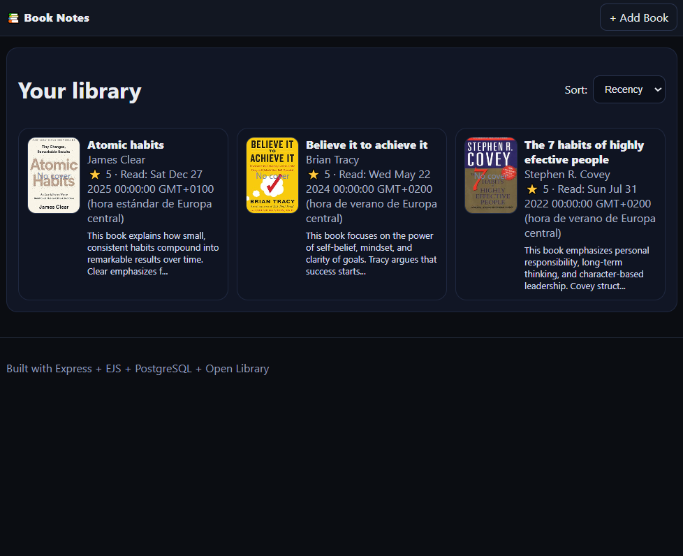

## Preview

# Book Notes Capstone (Express + EJS + PostgreSQL + Open Library)

A simple app to store books you’ve read with notes + ratings, and fetch book covers using Open Library.

## Features
- CRUD books in PostgreSQL
- Sorting by recency, rating, title
- Open Library search to prefill title/author/ISBN
- Covers displayed via Open Library Covers API

